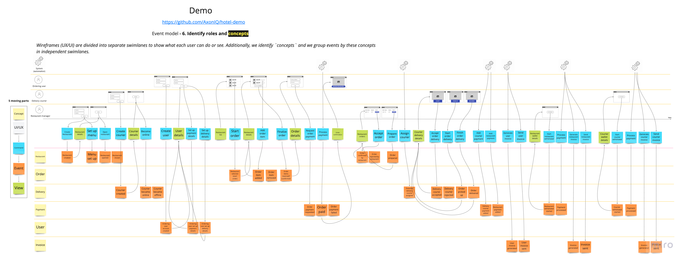

PL

# Rozdział 1:  Event Storming

## 1.1 Wstęp

W celu zrozumienia procesów oraz zidentyfikowania potencjalnych mikroserwisów w tworzonej aplikacji,
przeprowadzono sesję Event Stormingu. Metoda ta umożliwia wizualizację i modelowanie procesów
biznesowych w ramach systemu, co jest kluczowe przy tworzeniu złożonych systemów informatycznych. W
niniejszym rozdziale przedstawione zostaną wyniki sesji Event Stormingu, która została
przeprowadzona z wykorzystaniem narzędzia Miro.

## 1.2 Narzędzie Miro

Miro to interaktywna platforma do współpracy, umożliwiająca tworzenie tablic z notatkami, rysunkami
i diagramami. Wybór tego narzędzia był podyktowany jego prostotą użytkowania oraz możliwościami
wizualizacji modelu związanego z Event Stormingiem.

## 1.3 Identyfikacja kontekstów granicznych (Bounded Context)

W wyniku sesji Event Stormingu zidentyfikowano pięć kontekstów granicznych (Bounded Context), które
będą kluczowe dla tworzonej aplikacji. Są to:

1. Restaurant - obejmuje zarządzanie restauracjami, menu i dostępnością produktów.
2. Order - odpowiada za proces zamówienia, takie jak składanie, modyfikowanie i anulowanie zamówień.
3. Delivery - koncentruje się na logistyce dostaw, monitorowaniu statusu dostawy oraz komunikacji
   z dostawcą. Zarządza również bazą dostawców.
4. Payment - zarządza procesem płatności, obejmuje różne metody płatności oraz obsługę transakcji.
   Obsługuje wszelkie rozliczenia w ramach systemu.
5. User - dotyczy zarządzania kontami użytkowników, uwierzytelniania oraz zarządzania uprawnieniami.
6. Invoice - odpowiada za generowanie faktur.

## 1.4 Analiza procesów

Każdy z wyżej wymienionych kontekstów granicznych został poddany analizie procesów, które występują
w ramach danej domeny. W trakcie analizy zidentyfikowano następujące kluczowe zdarzenia:

1. **Restaurant:**
    - Dodanie nowej restauracji
    - Aktualizacja informacji o restauracji
    - Dodanie/aktualizacja menu
    - Zmiana dostępności restauracji
    - Przyjęcie lub odrzucenie zamówienia przez restaurację
    - Aktualizacja statusu zamówienia (gotowe do odbioru)

2. **Order:**
    - Utworzenie nowego zamówienia
    - Modyfikacja zamówienia
    - Anulowanie zamówienia
    - Finalizacja zamówienia

3. **Delivery:**
    - Dodanie nowego dostawcy
    - Aktualizacja informacji o dostawcy
    - Zmiana dostępności dostawy
    - Przypisanie dostawcy do zamówienia
    - Wytyczenie trasy dostawy
    - Odbiór zamówienia przez dostawcę
    - Dostarczenie zamówienia do klienta

4. **Payment:**
    - Przyjęcie płatności za zamówienie
    - Obsługa nieudanej płatności
    - Rozliczenie płatności z dostawcą
    - Rozliczenie płatności z restauracją
    - Obsługa zwrotu płatności w przypadku anulowania zamówienia
    - Wypłata środków do restauracji
    - Wypłata środków do dostawcy

5. **User:**
    - Rejestracja nowego użytkownika
    - Logowanie użytkownika
    - Aktualizacja danych użytkownika (metody płatności, adresy dostawy, preferencje)
    - Usunięcie konta użytkownika

6. **Invoice:**
    - Generowanie faktury dla restauracji
    - Generowanie faktury dla dostawcy
    - Generowanie faktury dla zamawiającego

## 1.5 Reprezentacja graficzna

